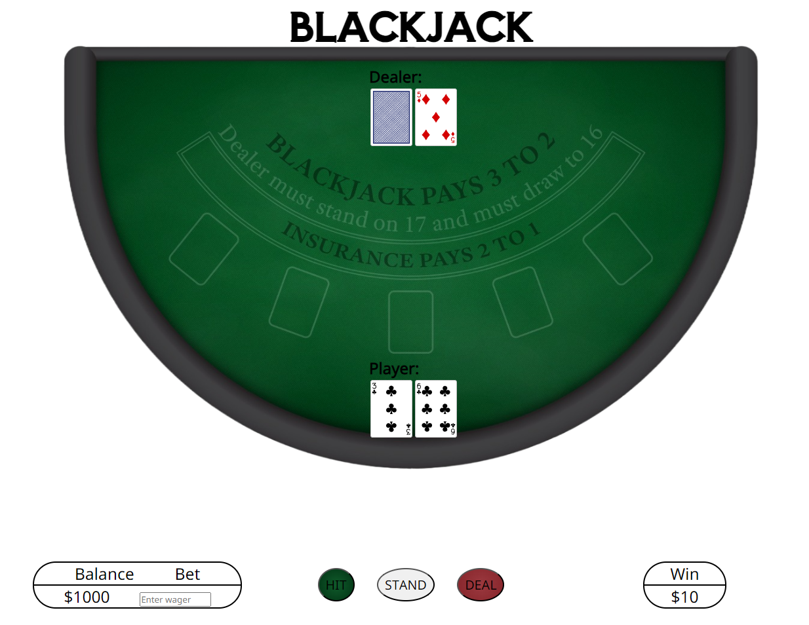

# Blackjack

**Beat the Dealer.** The objective of the game of blacjack is at its basis, to try and beat the dealer. 

To beat the dealer:
1. Draw a hand value that is closer to 21 than the dealer.
2. The dealer draws a hand value that goes over 21.

Some rules:
1. Cards 2 through 10 count as face value, i.e a 2 card counts as 2
2. Face cards (J,Q,K) count as 10.
3. Ace can count as 1 or 11 depending on which value helps the hand.

## The Game

**Deal.** Click on *_deal_*. The 'dealer' will start the game by dealing two cards to the player and two cards for herself, one card will be dealt face down. Now we play!

**Play.** You decide how you want to play the hand. First, add the card values together, and get a hand total. If your hand total is 21, congrats! That's blackjack! Otherwise, you have some decisions to make. You can *_stand_* (click stand) if you are satisfied with your hand, this moves the turn to the dealer. You can also *_hit_* (click hit) if you would like more cards to improve your hand total. This will deal one card at a time until you either 'Bust' (go over 21) or are satisfied with your hand and *_stand_* (click stand), which will then move the turn to the dealer.

**Dealer Plays.** The 'dealer' adds their card values together. If the dealer has a hand total of 17 or greater, they will stand. If the dealer has a hand total less than 17, they will *_hit_* for additional cards.

**Winnings** The hand values will be compared. If you tie (even if you have blacjack) this is called a 'push'. If you have a hand value closer to 21 than the dealer or if the dealer goes over 21, you win! If not you lose. Sorry.

**Deal** Click on *_deal_* to deal the next hand.

Click [here](https://jesse-peraza.github.io/blackjack/) to play.

## Technologies Used
**Languages:** JavaScript, HTML, CSS

**IDE:** VSCode

## Future Features
* additional styling: 
  refining CSS, card flip animations, card overlap styling, a visible deck maybe?
* implementing more blackjack features:
  double down, split, betting
* refactoring code to be more *_DRY_*
